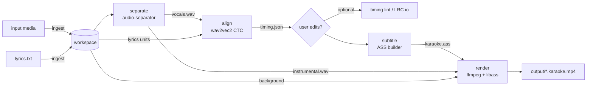

# openkaraoke — v1 Design

- **Status:** Approved for issue planning (2026-07-06)
- **Product one-liner (canonical, from README):** 任意の曲からカラオケ動画を生成する
  — *Generate a karaoke video from any song.*
- **Scope decisions (confirmed with the product owner, 2026-07-06):**
  Python CLI tool / local audio + video file input (no YouTube) /
  user-provided lyrics + automatic alignment / classic wipe-style lyric display.
- **Related docs:** `docs/research/2026-07-technology-landscape.md`,
  `docs/decisions/ADR-001`…`ADR-006`, `docs/ISSUE_PLAN.md`, `docs/issues/*.md`.

---

## 1. Product definition

### 1.1 What it does

Given (a) a locally stored song file (audio, or video whose audio track is the
song) and (b) the lyrics as plain text, `openkaraoke` produces an MP4 karaoke
video: the original vocals are removed by AI source separation, and the lyrics
are displayed line-by-line with a classic karaoke **wipe** (color fill that
progresses in sync with the sung position), automatically timed by forced
alignment against the isolated vocal track.

### 1.2 Target users

| Persona | Need |
|---|---|
| Hobby singer / karaoke party host | Turn owned songs into singable karaoke videos for private use |
| VTuber / cover-song creator | Produce off-vocal + wiped-lyrics material from own or licensed content |
| Developer | Scriptable, composable CLI; deterministic re-render after manual timing fixes |

Primary language target: **Japanese songs first-class**, English supported.
UI/console messages: English (v1); docs bilingual where practical.

### 1.3 Design principles

1. **Fully local.** No paid APIs, no cloud processing, no telemetry. Network is
   used only for explicit, pinned model downloads (ADR-006).
2. **User-supplied content only.** The tool never fetches songs or lyrics from
   the internet. This is both a legal posture and a product boundary.
3. **Editable intermediates.** Automatic timing will be imperfect; the timing
   file is a first-class, human-editable artifact, and every stage can be re-run
   cheaply and deterministically (ADR-005).
4. **Boring, inspectable pipeline.** Each stage reads/writes files in a
   per-song workspace; stages are independently runnable CLI commands.
5. **Executable by low-capability agents.** Modules are small, contracts are
   schema-defined, behaviors are specified to the level of exact file formats
   and command lines.

### 1.4 v1 scope

- Inputs: local audio (`.mp3 .wav .flac .m4a .ogg .aac`) and local video
  (`.mp4 .mov .mkv .webm`) files; lyrics as UTF-8 plain text; optionally
  pre-timed lyrics as (enhanced) LRC.
- Languages: `ja`, `en` (alignment model registry is extensible).
- Vocal separation into `vocals` + `instrumental` (2-stem).
- Forced alignment of user lyrics to the vocal stem; per-unit (character/word)
  timestamps; editable `timing.json`; LRC import/export.
- ASS subtitle generation: two-zone rotating line display, per-unit `\kf` wipe,
  next-line preview, intro/gap countdown.
- Rendering to MP4 (H.264 + AAC) with solid-color, still-image, or
  source-video background (when the input was a video).
- CLI: `new, generate, quick, separate, align, subtitle, render, timing,
  inspect, models, doctor` (see §6).
- Platforms: macOS 14+ (Apple Silicon incl. MPS/CoreML), Linux x86_64
  (CPU/CUDA). Windows: best effort, not a v1 gate.

### 1.5 v1 non-goals (explicit)

- No YouTube / streaming-site download or upload of any kind.
- No lyrics fetching, scraping, or lyrics-API integration.
- No ASR transcription (lyrics text is always provided by the user in v1).
- No pitch detection, scoring, key change, or player/queue features.
- No GUI / web UI; no daemon mode.
- No CDG, UltraStar, or DVD formats.
- No ruby (furigana) rendering (reserved for v2; see §12).

### 1.6 v2 deferred ideas

ASR draft mode (Whisper-assisted lyrics drafting), ruby/furigana display, local
web UI timing editor, batch processing, loudness normalization (EBU R128),
Windows first-class support, visualizer backgrounds, karaoke duet coloring,
plugin interface for extra separation/alignment backends, translation line.

---

## 2. User experience

### 2.1 Installation (target)

```bash
uv tool install openkaraoke            # or: pipx install openkaraoke
openkaraoke doctor                     # verifies ffmpeg, fonts, device, models
```

`ffmpeg` (≥ 6, with libass) is an external prerequisite; `doctor` explains
platform-specific install steps. A CJK-capable font (recommended: Noto Sans
CJK) is required for Japanese rendering and is checked by `doctor`.

### 2.2 Primary flow (audio input, Japanese song)

```bash
openkaraoke new ./yoru-ni-kakeru --input ~/Music/yoru.m4a --lyrics ./lyrics.txt --language ja
openkaraoke generate ./yoru-ni-kakeru
# → ./yoru-ni-kakeru/output/yoru-ni-kakeru.karaoke.mp4
```

`generate` runs the remaining stages in order: `separate → align → subtitle →
render`, with progress output. Each stage is resumable/cached (§4.6).

### 2.3 Timing correction loop (the expected happy path)

```bash
openkaraoke align ./proj                # writes lyrics/timing.json
$EDITOR ./proj/lyrics/timing.json       # nudge start_ms/end_ms values
openkaraoke timing lint ./proj          # validates invariants
openkaraoke subtitle ./proj && openkaraoke render ./proj
```

Editing `timing.json` marks downstream stages stale; `generate` re-runs only
what is needed. Users who prefer LRC can `timing export-lrc`, edit in any LRC
tool, then `timing import-lrc`.

### 2.4 One-shot convenience

```bash
openkaraoke quick song.mp3 lyrics.txt -o out.mp4 --language ja
# creates ./song.okproj/ workspace next to the input, then runs generate
```

### 2.5 Video-input flow

```bash
openkaraoke new ./mv --input ./my_mv.mp4 --lyrics lyrics.txt
# style.toml: background.mode = "source_video" (default when input is video)
openkaraoke generate ./mv
```

The original video is used as the background (optionally darkened/blurred for
readability) and its audio is replaced by the instrumental.

---

## 3. Architecture overview

### 3.1 Pipeline



### 3.2 Stage contract table

| Stage | Reads | Writes | External tool | Idempotency key (inputs_hash over) |
|---|---|---|---|---|
| `ingest` (part of `new`) | input media, lyrics.txt | `input/`, `audio/source.wav`, `audio/analysis.wav` (after separate; see §5.1), `project.json`, `style.toml`, `lyrics/lyrics.txt` | ffprobe, ffmpeg | input file hash + lyrics hash |
| `separate` | `audio/source.wav` | `audio/vocals.wav`, `audio/instrumental.wav` | audio-separator (torch/onnxruntime) | source.wav hash + model id/version + params |
| `align` | `audio/vocals.wav`, parsed lyrics | `lyrics/timing.json` | torch, torchaudio, transformers | vocals hash + lyrics hash + model id/revision + params |
| `subtitle` | `lyrics/timing.json`, `style.toml` | `subtitles/karaoke.ass` | — (pure) | timing hash + style hash |
| `render` | `karaoke.ass`, `audio/instrumental.wav`, background | `output/<slug>.karaoke.mp4` | ffmpeg | ass hash + instrumental hash + bg hash + style video params |

### 3.3 Module map (source layout)

```
src/openkaraoke/
  __init__.py            # version
  cli/
    __init__.py          # click group, global flags
    new.py generate.py quick.py stages.py timing.py inspect.py models.py doctor.py
  config/
    schema.py            # pydantic models: AppConfig, StyleConfig
    loader.py            # layered loading, platformdirs paths
  workspace/
    manifest.py          # project.json models + state machine
    layout.py            # path constants, workspace creation, confinement guard
    hashing.py           # sha256 helpers, inputs_hash composition
  media/
    probe.py             # ffprobe wrapper + validation
    extract.py           # ffmpeg audio extraction/resample
    ffmpeg.py            # binary discovery, argv runner, progress parse
  lyrics/
    parser.py            # lyrics.txt → LyricsDocument
    segment.py           # per-language wipe-unit segmentation
    normalize.py         # NFKC etc.
  timing/
    model.py             # TimingDocument pydantic models
    lint.py              # invariant checks + diagnostics
    lrc.py               # enhanced LRC import/export
  separation/
    base.py              # SeparationBackend protocol
    audio_separator_backend.py
  alignment/
    base.py              # AlignmentBackend protocol
    emissions.py         # chunked wav2vec2 log-prob computation
    ctc.py               # forced_align invocation, spans → units
    registry.py          # per-language model registry (pinned)
  subtitles/
    ass.py               # ASS document builder (styles/events/escaping)
    program.py           # two-zone rotation, preview, countdown planning
  render/
    command.py           # ffmpeg argv builder (backgrounds, filtergraph)
    executor.py          # run + progress + output verification
  models_cache/
    registry.py          # pinned model metadata (ids, files, sha256)
    store.py             # cache dir mgmt, download, verify, offline mode
  errors.py              # exception hierarchy + exit codes
  logging.py             # rich console + file logs
```

Rules: `cli/*` contains no business logic (thin argument parsing + calls into
modules). ML imports (`torch`, `transformers`, `audio_separator`) are **lazy**
(function-local) so that non-ML commands (`timing`, `inspect`, `subtitle`,
`doctor` basics) start fast and work without ML extras installed.

### 3.4 Dependency policy

| Dependency | Role | Tier |
|---|---|---|
| click ≥ 8.1 | CLI | core |
| pydantic ≥ 2.7 | schemas/validation | core |
| platformdirs, rich, soundfile, numpy | paths, console, wav IO | core |
| audio-separator | separation backend | ml extra |
| torch, torchaudio, transformers, huggingface_hub | alignment backend | ml extra |
| ffmpeg / ffprobe (external binaries) | probe/extract/render | system |

Version pins are set in `pyproject.toml` with lower bounds + tested upper
bounds; `uv.lock` is committed. Accelerator selection follows the uv PyTorch
guide (extras `cpu` / `cu126+` and explicit indexes) — details in issue 30.

---

## 4. Workspace and data contracts

### 4.1 Workspace layout (fixed names, all ASCII)

```
<project>/
  project.json          # manifest (§4.2) — machine-managed
  style.toml            # style config (§4.5) — user-editable
  input/
    original<ext>       # verbatim copy of the input media
  lyrics/
    lyrics.txt          # user lyrics (copied at new; user-editable)
    timing.json         # canonical timing (§4.3) — machine-written, user-editable
  audio/
    source.wav          # 44.1 kHz stereo PCM (separation input)
    analysis.wav        # 16 kHz mono PCM (alignment input, from vocals.wav)
    vocals.wav          # separation output
    instrumental.wav    # separation output
  subtitles/
    karaoke.ass
  output/
    <slug>.karaoke.mp4
  logs/
    <stage>-<yyyymmdd-HHMMSS>.log
```

- `<slug>` = project directory basename, sanitized `[a-z0-9-]` (§8 T6).
- The input is **always copied** into the workspace (self-contained,
  reproducible re-renders). Large video inputs: documented cost; `--no-copy`
  is a v2 idea.
- All stage code must write only inside the workspace, the cache dir, or an
  explicit `--output` path (confinement guard, §8 T6).

### 4.2 `project.json` (manifest) — schema v1

```jsonc
{
  "schema_version": 1,
  "openkaraoke_version": "0.1.0",
  "created_at": "2026-07-06T12:00:00+09:00",
  "language": "ja",                       // BCP-47 primary subtag; v1: "ja" | "en"
  "slug": "yoru-ni-kakeru",
  "input": {
    "original_filename": "yoru.m4a",
    "stored_as": "input/original.m4a",
    "media_type": "audio",                // "audio" | "video"
    "sha256": "…",
    "duration_ms": 262000,
    "probe": { /* trimmed ffprobe summary: container, streams[] {codec, type, sample_rate, width, height, fps} */ }
  },
  "stages": {
    "separate":  { "status": "done",     // "pending" | "done" | "failed"
                   "inputs_hash": "…",   // recompute→differs ⇒ treated as stale
                   "params": {"model_id": "bs_roformer_ep_317", "device": "mps"},
                   "tool_versions": {"audio_separator": "…", "torch": "…"},
                   "started_at": "…", "finished_at": "…", "log": "logs/separate-….log",
                   "error": null },
    "align":     { "…": "same shape; params: {model_ref, revision, chunk_s}" },
    "subtitle":  { "…": "params: {style_hash}" },
    "render":    { "…": "params: {video: {w,h,fps,crf,preset}}, output: {path, sha256}" }
  }
}
```

Rules:

- Written atomically (write temp file in same dir + `os.replace`).
- `staleness(stage)` is **computed at load time**: recompute `inputs_hash` from
  current file hashes + params; if ≠ stored, stage is *stale*. `generate` runs
  stages whose status ≠ `done` or which are stale, in pipeline order; a stale
  stage marks all downstream stages stale transitively.
- Unknown extra fields: rejected (pydantic `extra="forbid"`) — manifest is
  machine-owned. `schema_version` ≠ 1 ⇒ error with upgrade hint (exit 8).

### 4.3 `timing.json` — schema v1 (canonical, editable)

```jsonc
{
  "schema_version": 1,
  "language": "ja",
  "offset_ms": 0,                  // global shift applied at subtitle build
  "generator": {"backend": "ctc-wav2vec2", "model_ref": "jonatasgrosman/wav2vec2-large-xlsr-53-japanese", "revision": "…"},
  "lines": [
    {
      "id": "L001",                // stable, L### in source order
      "text": "夜に駆ける",         // display text (post-normalization)
      "section_break_after": false,// blank line followed in lyrics.txt
      "start_ms": 12340,           // = first unit start (kept explicit)
      "end_ms": 15200,             // = last unit end
      "units": [
        {"text": "夜", "start_ms": 12340, "end_ms": 12680, "confidence": 0.92, "timed": true},
        {"text": "に", "start_ms": 12680, "end_ms": 12910, "confidence": 0.88, "timed": true}
        // "timed": false ⇒ value came from interpolation, not alignment
      ]
    }
  ]
}
```

Invariants (enforced by `timing lint`, exit 4 on error):

1. Within a line: units sorted, `start_ms ≤ end_ms`, no overlap
   (`units[i].end_ms ≤ units[i+1].start_ms`).
2. Lines sorted by `start_ms`; overlapping lines allowed only up to 500 ms
   (warning), > 2000 ms is an error.
3. All values integer milliseconds ≥ 0; last end ≤ media duration + 1000 ms.
4. `line.text` equals concatenation of unit texts plus attached punctuation
   (lint recomputes and warns on drift; units are the source of truth).
5. Unit duration ≥ 30 ms (warning below 60 ms).

### 4.4 `lyrics.txt` format

- UTF-8 (BOM tolerated and stripped); size cap 64 KiB; control chars other
  than `\n`, `\t` rejected (exit 4).
- One **display line** per text line (the author controls line breaks).
- Blank line(s) ⇒ section break (`section_break_after: true` on previous line;
  used for countdown insertion, §5.4).
- Lines starting with `#` are comments (ignored).
- No inline markup in v1. `（…）`/`(…)` are ordinary text (sung back-vocals
  etc.). A future ruby syntax is deliberately **not** reserved in v1.

### 4.5 `style.toml` — schema v1 (user-editable; validated by pydantic)

```toml
schema_version = 1

[video]
width = 1920            # 640..3840
height = 1080           # 360..2160
fps = 30                # 24..60
crf = 18                # 10..35
preset = "medium"       # x264 preset enum

[background]
mode = "auto"           # "auto" | "solid" | "image" | "source_video"
                        # auto ⇒ source_video if input is video else solid
color = "#101020"       # for solid
image_path = ""         # for image (absolute or project-relative)
darken = 0.35           # 0.0..0.8, applied over image/video for readability
blur = 0.0              # 0.0..1.0 → mapped to boxblur radius

[font]
family = "Noto Sans CJK JP"
size_px = 72            # at PlayRes 1920x1080
bold = true
outline_px = 4
shadow_px = 2

[colors]                # #RRGGBB or #RRGGBBAA
upcoming = "#FFFFFF"    # pre-wipe text fill
sung = "#33CCFF"        # post-wipe fill
outline = "#000000"
shadow = "#00000080"

[layout]
margin_bottom_px = 90   # lower zone baseline margin (PlayRes-relative)
zone_gap_px = 130       # distance between lower and upper zone baselines
margin_side_px = 100

[timing_display]
lead_in_ms = 1000       # line appears this early
lead_out_ms = 500       # line stays after last unit
countdown_intro = true
countdown_gap_threshold_ms = 8000   # gaps ≥ this get a countdown
countdown_dots = 5                  # dots at 1 s spacing

[audio]
gain_db = 0.0           # -12.0..12.0 applied to instrumental at render
```

Unknown keys ⇒ error with the offending key path (config is user-facing;
`extra="forbid"` with a helpful message). All numeric ranges validated.

### 4.6 Hashing and staleness

- `sha256_file` streamed in 1 MiB chunks; stored lowercase hex.
- `inputs_hash(stage) = sha256(json.dumps({"files": {relpath: sha256, …}, "params": {…}, "schema": 1}, sort_keys=True))`
  where `files` are exactly the stage's declared inputs (§3.2).
- Editing `timing.json` or `style.toml` by hand therefore automatically marks
  `subtitle`/`render` stale — this **is** the edit-loop mechanism.

### 4.7 Enhanced LRC mapping

- Export: line tag `[mm:ss.xx]` from `line.start_ms`; word tags `<mm:ss.xx>`
  before each unit; trailing `<mm:ss.xx>` for line end. Header: `[re:openkaraoke]`,
  `[ve:1]`, `[offset:±ms]` from `offset_ms`.
- Import: accepts line-only LRC (units become a single line-wide unit,
  `timed: true`, lint warning "no word timing") and enhanced LRC. On import the
  text of each LRC line must match a lyrics line after normalization
  (§5.3 normalization); mismatch ⇒ error listing the first 3 diffs (exit 4).
- Round-trip guarantee: export→import is lossless for `start_ms`/`end_ms`
  at 10 ms resolution (LRC centisecond limit — documented).

---

## 5. Stage specifications

### 5.1 Ingest (inside `new`)

1. Validate project dir: must not exist or be empty; create layout (§4.1).
2. Probe input with ffprobe (§ media.probe): require exactly one audio stream
   selected (first by default; `--audio-stream N` override); duration
   1 s – 20 min (configurable cap, default 20 min; exit 4 beyond).
   Video inputs: record width/height/fps of first video stream.
3. Copy input verbatim to `input/original<ext>` (extension lowercased,
   from a whitelist; the *content* is still treated as untrusted — parsing
   happens only inside ffmpeg/ffprobe).
4. Extract `audio/source.wav`: `ffmpeg -i input -map a:<n> -ac 2 -ar 44100 -c:a pcm_s16le`.
5. Copy lyrics to `lyrics/lyrics.txt` after §4.4 validation; parse to verify.
6. Write `style.toml` from template (background.mode auto) and `project.json`.

Note: `audio/analysis.wav` (16 kHz mono, **from `vocals.wav`**) is produced by
the `align` stage lazily, since it depends on separation output.

### 5.2 Separate

- Backend protocol: `SeparationBackend.separate(source_wav: Path, out_dir: Path, *, model_id: str, device: DeviceChoice) -> SeparationResult{vocals: Path, instrumental: Path}`.
- v1 implementation wraps `audio_separator.separator.Separator`:
  - `model_file_dir` = openkaraoke cache dir (§8 T4), not the library default.
  - Default model: `model_bs_roformer_ep_317_sdr_12.9755.ckpt` (pinned in the
    model registry with size + sha256 recorded at first verified download).
  - Output naming forced to `vocals.wav` / `instrumental.wav` via the
    library's output-name options; sample rate preserved (44.1 kHz).
  - Device: `auto` probes CUDA → CoreML/MPS → CPU; explicit `--device` wins.
- Failure modes: model missing + `--offline` ⇒ exit 6; backend exception ⇒
  exit 7 with last 30 log lines and the log file path.

### 5.3 Align

**Text side.** `lyrics/parser.py` + `segment.py` produce, per line, an ordered
list of **wipe units**:

- Normalization: NFKC → collapse internal whitespace runs to single space →
  strip. (Applied identically for LRC import matching.)
- `ja` segmentation (deterministic, no morphological analyzer in v1):
  1. Iterate grapheme clusters.
  2. Start a new unit on each base character.
  3. Merge into the *previous* unit: small kana `ぁぃぅぇぉゃゅょっゎ` +
     katakana equivalents `ァィゥェォャュョッヮ`, prolonged sound mark `ー`,
     iteration marks `ゝゞヽヾ`.
  4. Consecutive Latin letters/digits/apostrophe form one unit (embedded
     English words).
  5. Punctuation and spaces are never their own unit: attach to the previous
     unit's display text (line-leading punctuation attaches to the next unit).
- `en` segmentation: split on whitespace; each token is a unit; surrounding
  punctuation stays with the token; hyphenated words are one unit.
- Alignment target text per unit: unit text lowercased, punctuation stripped;
  characters not in the model vocabulary are mapped to the wildcard token.

**Audio side (`alignment/emissions.py`).**

1. Ensure `audio/analysis.wav`: `ffmpeg -i vocals.wav -ac 1 -ar 16000 -c:a pcm_s16le`.
2. Load with `soundfile` (float32). Model: per-language registry entry
   (`ja` → `jonatasgrosman/wav2vec2-large-xlsr-53-japanese` @ pinned revision,
   `en` → torchaudio `WAV2VEC2_ASR_BASE_960H` bundle), loaded lazily,
   `local_files_only=True` when `--offline`.
3. Chunked inference: window 30 s, hop 28 s (2 s overlap). Per window compute
   `log_softmax` emissions; discard the first/last 1 s of each interior window
   boundary when concatenating (edge windows keep their outer edge).
4. Assert frame rate ≈ 20 ms/frame (derived `total_samples / n_frames / 16000`;
   tolerance ±10%); record `frame_ms`.

**Alignment core (`alignment/ctc.py`).**

1. Build target token sequence over the whole song: per unit, per character →
   vocab id; unknown → wildcard id `V` (one extra emission column appended
   whose value per frame = max over non-blank real tokens — the whisperX
   wildcard technique, reimplemented; attribute in module docstring).
2. `torchaudio.functional.forced_align(log_probs[1,T,V+1], targets[1,L], blank=blank_id)`
   → per-frame paths; `torchaudio.functional.merge_tokens` → token spans.
3. Map spans back to units via token-count bookkeeping. Unit
   `start_ms = round(span_first.start * frame_ms)`, `end_ms = round(span_last.end * frame_ms)`;
   `confidence = mean(exp(span.score))`; clamp `end ≥ start + 30 ms`.
4. Units that aligned only via wildcard or with confidence < 0.15:
   set `timed: false` and linearly interpolate their boundaries between the
   nearest `timed: true` neighbors **within the same line**; a fully untimed
   line is distributed uniformly between neighbor lines and reported.
5. Global sanity: if > 30% of units are untimed, or line order is broken,
   exit 7 with a diagnostic report listing the 10 worst lines (likely causes:
   wrong lyrics, wrong language, instrumental input).
6. Write `timing.json` (§4.3).

Determinism: `torch.manual_seed(0)`, inference mode, no dropout — outputs are
deterministic for a given model revision + audio.

### 5.4 Subtitle (pure function: timing.json + style.toml → karaoke.ass)

**ASS skeleton.** `[Script Info]`: `ScriptType: v4.00+`, `PlayResX/Y` = style
video w/h, `WrapStyle: 2`, `ScaledBorderAndShadow: yes`. `[V4+ Styles]`:
`KaraokeLower` (Alignment=2, MarginV=margin_bottom_px), `KaraokeUpper`
(Alignment=2, MarginV=margin_bottom_px+zone_gap_px), `Countdown` (Alignment=2,
above upper zone). Colors from style (§4.5) converted `#RRGGBB[AA]` →
`&HAABBGGRR&` (ASS alpha 00=opaque; spec the conversion precisely in code).
`PrimaryColour` = sung, `SecondaryColour` = upcoming (karaoke wipe semantics),
`OutlineColour`, `BackColour` = shadow.

**Two-zone rotation program (`subtitles/program.py`).** Lines alternate
Lower → Upper → Lower… by index (L001 lower, L002 upper, L003 lower, …).

Event windows:

- `show_at = start_ms - lead_in_ms`, `hide_at = end_ms + lead_out_ms`.
- A zone's next occupant may not appear before its previous occupant hides;
  if `show_at < prev_same_zone.hide_at`, shift `show_at` up to it (and if that
  eats into `start_ms`, reduce lead-in silently — never delay the wipe).
- Karaoke text per event:
  `{\k<wait_cs>}` + for each unit `{\kf<dur_cs>}<escaped unit text>` where
  `wait_cs = (start_ms - show_at)/10`, `dur_cs = (unit.end - unit.start)/10`;
  inter-unit gaps > 0 emit `{\k<gap_cs>}` fillers. Rounding: accumulate in ms
  and emit floor-with-carry so total cs drift ≤ 1 cs per line.
- Overlapping zones are expected (preview); libass layering handled via
  distinct styles and `Layer: 0`.

**Countdown.** If `countdown_intro` and first line `start_ms ≥ 6000`: event in
`Countdown` style with `countdown_dots` dots, each `{\kf100}●`, ending exactly
at first line `start_ms` (i.e. starts at `start_ms - dots*1000`; visible from
`start_ms - dots*1000 - 500`). Same for any inter-line gap ≥
`countdown_gap_threshold_ms` (count from `section_break_after` lines only if
both conditions hold — gap threshold is the trigger, section break is not
required). Dots wipe with `sung` color.

**Escaping (security-relevant, §8 T3).** Display text transform before ASS
write: `{` → `｛`, `}` → `｝`, `\` → `＼` (fullwidth substitutes; lint reported);
strip ASCII control chars; forbid a literal `Dialogue:`-breaking newline (text
is single-line by construction). Golden tests cover injection attempts.

### 5.5 Render

**Command builder (`render/command.py`)** produces an argv list (never a shell
string), executed with `cwd = <project dir>` so the filtergraph references the
fixed relative path `subtitles/karaoke.ass` (no path escaping problem; §8 T2).

Background variants:

| mode | ffmpeg inputs | filtergraph (conceptual) |
|---|---|---|
| solid | `-f lavfi -i color=c=<hex>:s=<WxH>:r=<fps>:d=<dur_s>` + instrumental | `[0:v]subtitles=subtitles/karaoke.ass:fontsdir=<cachefonts?no—v1 system fonts>,format=yuv420p` |
| image | `-loop 1 -framerate <fps> -i input/bg<ext>` + instrumental | scale+pad to WxH → eq=brightness(darken) → boxblur(blur) → subtitles → format |
| source_video | `-i input/original.mp4` + instrumental | scale+pad → darken/blur → subtitles → format; `-map 0:v -map 1:a`, `-shortest` |

Encoding: `-c:v libx264 -preset <preset> -crf <crf> -r <fps> -c:a aac -b:a 192k -ar 44100 -movflags +faststart`;
audio gain via `-filter:a volume=<gain_db>dB` when ≠ 0. Duration = instrumental
duration (`-shortest` for looped/solid inputs; `-t` fallback for lavfi).

**Executor (`render/executor.py`).** Runs ffmpeg with `-progress pipe:1
-nostats`; parses `out_time_us` for a rich progress bar; hard timeout
(default `10 × duration`, min 10 min); captures stderr to the stage log.
Post-check with ffprobe: container ok, video+audio streams present, duration
within ±2 s of expected — else exit 7 (do not leave a half-written file:
render to `output/.tmp-<slug>.mp4`, `os.replace` on success).

---

## 6. CLI specification

Global: `--verbose/-v` (repeatable), `--quiet`, `--device [auto|cpu|cuda|mps]`,
`--offline`, `--config PATH` (user config override), `--version`. Console
output via rich; with `--json` on supporting commands, stdout is a single JSON
document and all human output goes to stderr.

| Command | Signature | Behavior / notable flags | Exit codes |
|---|---|---|---|
| `new` | `new DIR --input FILE --lyrics FILE [--language ja\|en] [--audio-stream N] [--force]` | Ingest per §5.1. `--force` allows non-empty DIR reuse (revalidates). Language default from user config (`default_language`, default `ja`). | 0,2,3,4,5 |
| `generate` | `generate DIR [--force] [--until STAGE]` | Runs pending/stale stages in order; `--force` re-runs all; `--until align` stops after that stage. | 0 + stage codes |
| `quick` | `quick INPUT LYRICS [-o OUT.mp4] [--language …] [--keep/--no-keep]` | Creates `<input-stem>.okproj/` next to input (error if exists, hint `--force` via `new`), runs generate, copies result to `-o` if given. `--no-keep` deletes workspace on success (default keep). | as generate |
| `separate` / `align` / `subtitle` / `render` | `STAGE DIR [--force] [stage flags]` | Single stage, honoring staleness (`--force` overrides). `separate --model ID`, `align --model-ref R --offset-ms N`, `render --output PATH`. | 0,4,5,6,7,8 |
| `timing` | `timing lint DIR` / `timing export-lrc DIR [-o F]` / `timing import-lrc DIR FILE` | §4.3 invariants; §4.7 mapping. Lint `--json` emits diagnostics array. | 0,4 |
| `inspect` | `inspect DIR [--json]` | Table: stage, status, staleness, params, durations, artifact sizes, log path. | 0,8 |
| `models` | `models list [--json]` / `models download [NAME…]` / `models verify` | Registry-driven (§8 T4). `download` fetches separation + alignment models for configured languages; `verify` re-hashes cache. | 0,5,6 |
| `doctor` | `doctor [--json]` | Checks table (§6.1). Exit 0 if all pass or only warnings; 5 on failures. | 0,5 |

### 6.1 `doctor` checks

| Check | Pass criteria | Failure guidance |
|---|---|---|
| ffmpeg / ffprobe found | version ≥ 6.0 | per-OS install snippet |
| libass in ffmpeg | `ffmpeg -hide_banner -filters` contains ` subtitles ` | "install ffmpeg with libass" |
| Python/runtime | interpreter ≥ 3.11, package version | — |
| ML extras importable | torch/torchaudio/transformers/audio_separator import (lazy; warn-only if extras not installed) | install extras command |
| Compute device | reports cuda/mps/coreml/cpu availability | — |
| CJK font | fontconfig (`fc-list :lang=ja`, Linux) or known font files (macOS: Hiragino paths; any OS: user-configured `font.family` resolvable) | recommend Noto Sans CJK |
| Model cache | registry entries present + hash ok (warn if absent) | `openkaraoke models download` |
| Disk space | ≥ 2 GiB free in cache dir & cwd | — |
| User config | parses + validates | show first error |

### 6.2 Exit codes (single source of truth in `errors.py`)

| Code | Name | Meaning |
|---|---|---|
| 0 | OK | success (warnings allowed) |
| 2 | USAGE | CLI misuse (click default) |
| 3 | CONFIG | invalid user/style config |
| 4 | INPUT | invalid media/lyrics/timing/LRC input |
| 5 | ENVIRONMENT | missing ffmpeg/font/extras |
| 6 | MODEL | model unavailable (offline/missing/hash mismatch) |
| 7 | STAGE | stage execution failure (separation/alignment/render) |
| 8 | WORKSPACE | corrupt/incompatible manifest, bad project dir |
| 10 | INTERNAL | unexpected exception (bug); prints issue-filing hint |

Every non-zero exit prints: one-line cause → remedy suggestion → log path
(when a stage log exists). Stack traces only with `-vv`.

---

## 7. Failure modes per stage (summary table)

| Stage | Failure | Detection | User-facing behavior |
|---|---|---|---|
| ingest | unsupported/corrupt media | ffprobe nonzero / no audio stream | exit 4, show probe stderr excerpt |
| ingest | >20 min or <1 s | probe duration | exit 4, mention `max_duration_min` config |
| ingest | lyrics not UTF-8 / too big / empty | decode/size checks | exit 4 with line/byte position |
| separate | OOM / backend crash | exception | exit 7 + suggest `--device cpu`, log path |
| separate | silent "vocals" (instrumental input) | RMS of vocals < −45 dBFS ⇒ warning | warn: alignment likely to fail |
| align | model download blocked | `--offline` + cache miss | exit 6 + `models download` hint |
| align | >30% units untimed | §5.3.5 | exit 7 + worst-lines report |
| align | lyrics/audio gross mismatch | same detector | same, hint: check language/lyrics |
| subtitle | timing invariant broken (hand-edit) | lint on load | exit 4 + `timing lint` diagnostics |
| render | ffmpeg fail / timeout | returncode/timer | exit 7 + last stderr lines |
| render | output verification fail | ffprobe re-check | exit 7, tmp file removed |
| any | manifest corrupt / schema mismatch | pydantic | exit 8 + "re-create with new / file bug" |

---

## 8. Security model

### 8.1 Posture

Local CLI processing **user-owned files**; the dominant risks are (1) parsing
untrusted media/lyrics, (2) supply chain of ML models and deps, (3) anything
that would silently touch the network. No server, no accounts, no secrets
stored by the tool (an optional `HF_TOKEN` env var is read by huggingface_hub
for gated models but never written, logged, or required).

### 8.2 Trust boundaries & threats

| ID | Boundary | Threat | Mitigation (→ issue) |
|---|---|---|---|
| T1 | Input media file (untrusted bytes) | Malicious container exploits parser | Never parse media in-process; only ffprobe/ffmpeg subprocesses parse it (their sandboxing is out of scope but versions surfaced by `doctor`; SECURITY.md advises updates). Validate probe JSON against schema; enforce duration/stream-count/resolution caps before further work. (→ 07, 27) |
| T2 | Subprocess invocation | Argument/shell injection via filenames | argv lists only, `shell=False`; user paths passed as discrete argv items, never embedded in filtergraphs; filtergraph uses only fixed workspace-relative names with `cwd=workspace` (§5.5). `-` -prefixed input paths neutralized via `./` prefixing. (→ 07, 15, 27) |
| T3 | Lyrics text → ASS | ASS tag injection (`{\...}`) altering render, resource-exhaustion glyph spam | Escaping map §5.4; 64 KiB cap; 300-line cap; unit-count cap 200/line. Injection golden tests. (→ 12, 27) |
| T4 | Model download (network) | Compromised/poisoned weights (pickle in `.ckpt`!) | Pinned registry: exact repo/filename/revision + sha256; verify after download and on `models verify`; refuse mismatched hash (exit 6). HF models loaded `use_safetensors=True` where available, pinned `revision`. RoFormer `.ckpt` residual pickle risk documented honestly in SECURITY.md; mitigation = hash pinning + upstream monitoring. No arbitrary model URLs via CLI in v1. (→ 17, 28) |
| T5 | Network policy | Silent phoning home | Runtime network use *only* inside `models download` / first-use download (with visible notice); `--offline` guarantees zero sockets (enforced in code paths + tested via socket-block fixture). No telemetry, no update checks. (→ 17, 28, ADR-006) |
| T6 | Filesystem writes | Path traversal/symlink escape from workspace; slug tricks | Confinement guard: every write path `resolve()`d and required to be under workspace root / cache root / explicit output path; slug sanitized `[a-z0-9-]{1,64}`; reject symlinked workspace subdirs on load. (→ 06, 27) |
| T7 | User/style config | Malicious config (paths, huge values) | pydantic ranges (§4.5); `image_path` confined to project dir or absolute-with-existence-check (no globs, no URLs). (→ 03, 14) |
| T8 | Dependencies | Vulnerable/typosquatted deps | `uv.lock` committed; Dependabot + `pip-audit` in CI; minimal core deps; ML stack isolated behind extras. (→ 02, 32) |
| T9 | Release pipeline | Tampered artifacts | GitHub Actions with actions pinned by SHA, least-privilege `GITHUB_TOKEN`, PyPI Trusted Publishing (OIDC), branch protection (already: no direct main push). (→ 32) |
| T10 | Legal/abuse | Tool used on unlicensed content; project distributing copyrighted fixtures | Tool ships zero copyrighted assets; test fixtures are synthetic; README/NOTICE state user responsibility; no download/scrape features (product boundary). (→ 29, 31) |

### 8.3 Secure defaults summary

Offline-capable after first model download; no shell subprocesses; atomic
writes; workspace confinement; pinned models with hashes; forbid-extra config
parsing; caps on all user-controlled sizes/counts.

---

## 9. Performance & resource expectations (to validate in issue 21/30)

| Stage | 4-min song, M2 Pro (MPS/CoreML) | CUDA (RTX 3060) | CPU (8-core) |
|---|---|---|---|
| separate (BS-RoFormer) | ~1–3 min | ~30–60 s | ~5–15 min |
| align (wav2vec2-large ja) | ~30–90 s | ~15–30 s | ~2–6 min |
| render (1080p30 x264 medium) | ~1–2 min | ~1–2 min | ~2–4 min |
| peak RAM | ~4–6 GiB | ~4–6 GiB (+VRAM ~4 GiB) | ~4–6 GiB |
| model cache disk | BS-RoFormer ~200–600 MiB + wav2vec2-ja ~1.2 GiB | | |

Numbers are order-of-magnitude planning estimates, to be measured and written
back into README by issue 21/30.

---

## 10. Compatibility matrix (v1 gates)

| Axis | Supported |
|---|---|
| OS | macOS 14+ (arm64), Linux x86_64 (glibc). Windows: not a v1 gate (tracked v2) |
| Python | 3.11, 3.12, 3.13 |
| ffmpeg | ≥ 6.0 with libass |
| Devices | CPU always; CUDA ≥ 12.x wheels; Apple MPS (torch) + CoreML (onnxruntime) |
| Media in | audio: mp3 wav flac m4a ogg aac; video: mp4 mov mkv webm |
| Media out | mp4 (H.264 High, yuv420p + AAC-LC) |

---

## 11. Testing & validation strategy

| Layer | Scope | Tooling / gate |
|---|---|---|
| Unit (pure) | lyrics parsing/segmentation, timing model+lint, LRC io, ASS builder, ffmpeg command builder, manifest state machine, config, registry | pytest; coverage ≥ 85% on these modules; golden files for ASS/LRC (byte-exact) |
| Contract | Separation/Alignment backend protocols with **fake backends** (canned stems / canned emissions) | pytest, no ML deps needed |
| Integration (system) | ffprobe/ffmpeg wrappers against tiny **synthetic** fixtures (generated by `scripts/make_fixtures.py`: 5 s sine + noise wav, 2 s color-bar mp4, committed, < 500 KiB total) | pytest markers `@pytest.mark.ffmpeg`; runs in CI (ffmpeg installed) |
| Integration (ML) | real separation+alignment on a 30 s synthetic voice+music mix | `@pytest.mark.ml`, nightly/manual only, not a PR gate |
| E2E smoke | `quick` with fake ML backends → real ffmpeg render → ffprobe assertions | CI PR gate |
| Alignment quality | manual playbook + eval harness on maintainer-local real songs (never committed — copyright) with hand-annotated reference timings; go/no-go: median unit-onset error ≤ 150 ms, p90 ≤ 400 ms on ja test set | issue 21; gates enabling `align` by default |
| Security | injection goldens (T3), path confinement (T6), offline socket-block (T5), hash-mismatch refusal (T4) | pytest, PR gate |

CI: GitHub Actions — `lint` (ruff format+check), `typecheck` (mypy; strict on
non-ML modules), `test` (Linux + macOS matrix, Python 3.11/3.13), `pip-audit`
(scheduled). ML nightly job optional-fail with issue auto-report (v2).

---

## 12. Known unknowns (may spawn new issues during implementation)

| # | Unknown | Planned resolution |
|---|---|---|
| U1 | Alignment quality on Japanese *singing* (vibrato, melisma, long vowels) | Issue 21 spike + tunables (chunking, wildcard threshold, interpolation); fallback plan: swap registry model / add whisperX as optional backend behind `AlignmentBackend` |
| U2 | CoreML provider actually accelerating BS-RoFormer (may silently fall back to CPU) | Measure in issue 18; document per-device reality |
| U3 | uv extras × audio-separator's onnxruntime extras interplay | Issue 30 packaging matrix testing |
| U4 | RoFormer `.ckpt` pickle risk depth (can we get safetensors variants?) | Issue 17/28: investigate `audio-separator` support for safetensors or convert-once-verify flow |
| U5 | Long songs (> 8 min) memory during separation on 16 GiB machines | Issue 18: chunked separation options; cap + docs otherwise |
| U6 | Font auto-detection reliability across distros | Issue 26: doctor heuristics; worst case explicit `font.family` config guidance |
| U7 | ja unit merge rules vs real karaoke mora conventions (ー handling, 々) | Issue 21 evaluation includes readability review; rules are config-free v1, revisit v2 |
| U8 | Whether `subtitle`+`render` should collapse into one command UX-wise | Collect usage feedback post-v1; no code impact (stages stay separate internally) |

---

## 13. Glossary

| Term | Meaning |
|---|---|
| **wipe** | Karaoke text fill progressing left→right in sync with singing (`\kf` in ASS) |
| **unit** | Smallest independently-timed text span (ja: merged character cluster; en: word) |
| **workspace / project dir** | Per-song directory holding all inputs/intermediates/outputs (§4.1) |
| **manifest** | `project.json`, machine-owned stage state + hashes |
| **stale** | Stage whose recorded `inputs_hash` no longer matches current inputs |
| **stem** | Separated audio component (vocals / instrumental) |
| **forced alignment** | Timing known text against audio (no transcription) |
| **emissions** | Per-frame log-probabilities over the CTC vocabulary |
