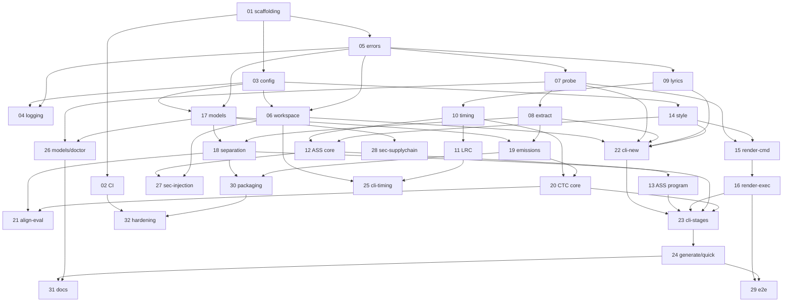

# openkaraoke — v1 Issue Plan

- **Date:** 2026-07-06
- **Design basis:** `docs/DESIGN.md` (canonical), ADR-001…006
- **Issue drafts:** `docs/issues/NN-short-title.md` (English; GitHub Issues are
  derived from these files and are stale artifacts relative to them)

## v1 completion statement

When **all issues 01–32 below are completed and their Validation sections
pass**, openkaraoke v1 (release 0.1.0) is complete: a user on macOS 14+
(Apple Silicon) or Linux x86_64 can `uv tool install openkaraoke`, run
`openkaraoke doctor` and `openkaraoke models download`, and turn a local song
file (audio or video) plus a UTF-8 lyrics text file into a 1080p MP4 karaoke
video with AI-separated instrumental and wipe-synchronized lyrics (Japanese
and English), including the manual timing-correction loop
(`timing.json` / LRC round-trip), with CI quality gates, the security model of
DESIGN §8 implemented and tested, user documentation, and a hardened release
pipeline in place.

The only intentionally remaining work after 01–32 comes from **known unknowns
U1–U8** (DESIGN §12) if their planned resolutions spawn follow-up issues, or
from newly discovered implementation findings.

## Issue list (recommended execution order)

| Order | # | File | Title | Size | Depends on |
|---|---|---|---|---|---|
| 1 | 01 | `01-project-scaffolding.md` | Project scaffolding: uv package, src layout, CLI entry stub | M | — |
| 2 | 02 | `02-ci-quality-gates.md` | CI workflows: lint, type-check, tests (Linux+macOS) | M | 01 |
| 3 | 03 | `03-config-module.md` | Configuration module: layered config + platformdirs | M | 01 |
| 4 | 05 | `05-error-framework.md` | Error framework and exit codes | S | 01 |
| 5 | 04 | `04-console-logging.md` | Console output and logging module | S | 01, 03 |
| 6 | 06 | `06-workspace-manifest.md` | Workspace layout, manifest, staleness state machine | L | 03, 05 |
| 7 | 07 | `07-media-probe.md` | ffmpeg/ffprobe runner and media probe with validation | M | 04, 05 |
| 8 | 08 | `08-audio-extraction.md` | Audio extraction/resample module | S | 07 |
| 9 | 09 | `09-lyrics-parser-segmentation.md` | Lyrics parser, normalization, ja/en unit segmentation | M | 05 |
| 10 | 10 | `10-timing-model-lint.md` | Timing document model and lint | M | 05, 09 |
| 11 | 11 | `11-lrc-import-export.md` | Enhanced LRC import/export | M | 10 |
| 12 | 14 | `14-style-config.md` | Style configuration (style.toml schema + template) | S | 03 |
| 13 | 12 | `12-ass-builder-core.md` | ASS builder core: styles, wipe events, escaping | L | 10, 14 |
| 14 | 13 | `13-ass-display-program.md` | ASS display program: zones, preview, countdown | M | 12 |
| 15 | 15 | `15-render-command-builder.md` | Render command builder (backgrounds, filtergraph) | M | 07, 14 |
| 16 | 16 | `16-render-executor.md` | Render executor: progress, timeout, output verification | M | 04, 15 |
| 17 | 17 | `17-model-registry-cache.md` | Model registry, cache store, download + hash verify | L | 03, 05 |
| 18 | 18 | `18-separation-backend.md` | Separation backend (audio-separator adapter) | M | 08, 17 |
| 19 | 19 | `19-alignment-emissions.md` | Alignment emissions: chunked wav2vec2 log-probs | M | 08, 17 |
| 20 | 20 | `20-alignment-ctc-core.md` | CTC forced alignment core: spans → timing.json | L | 10, 19 |
| 21 | 21 | `21-alignment-quality-eval.md` | Alignment quality eval harness + go/no-go playbook | M | 18, 20 |
| 22 | 22 | `22-cli-new.md` | CLI `new`: project creation and ingest | M | 06, 07, 08, 09, 14 |
| 23 | 23 | `23-cli-stage-commands.md` | CLI stage commands: separate/align/subtitle/render | M | 13, 16, 18, 20, 22 |
| 24 | 24 | `24-cli-generate-quick.md` | CLI `generate` orchestrator and `quick` | M | 23 |
| 25 | 25 | `25-cli-timing-inspect.md` | CLI timing tools and `inspect` | S | 06, 10, 11 |
| 26 | 26 | `26-cli-models-doctor.md` | CLI `models` and `doctor` | M | 07, 17 |
| 27 | 27 | `27-security-injection-confinement.md` | Security: text injection, path confinement, subprocess policy tests | M | 06, 07, 12 |
| 28 | 28 | `28-security-model-supplychain.md` | Security: download verification, offline guarantee, SECURITY.md | M | 17 |
| 29 | 29 | `29-e2e-smoke-fixtures.md` | E2E smoke suite with fake ML backends + synthetic fixtures | M | 16, 24 |
| 30 | 30 | `30-packaging-install-matrix.md` | Packaging: accelerator extras matrix, uv tool/pipx install | L | 01, 18, 19 |
| 31 | 31 | `31-user-docs-legal.md` | User documentation, README, legal notices | M | 24, 26 |
| 32 | 32 | `32-repo-release-hardening.md` | Repository & release hardening (Actions, publishing) | M | 02, 30 |

Sizes: S ≈ ½ day, M ≈ 1 day, L ≈ 1–2 days for a focused implementation agent.

## Dependency graph

## Implementation waves

| Wave | Issues | Theme | Exit criteria |
|---|---|---|---|
| W0 Foundations | 01, 02, 03, 05, 04 | Installable skeleton, CI green, config/errors/logging primitives | `uv run openkaraoke --version` works; CI gates on PRs |
| W1 Domain core | 06, 07, 08, 09, 10, 11 | Workspace + all non-ML data contracts | Unit suites green; fixtures probe/extract via real ffmpeg in CI |
| W2 Rendering | 14, 12, 13, 15, 16 | timing.json → ASS → MP4 with hand-written timing | Golden ASS tests; 5 s render smoke in CI |
| W3 ML backends | 17, 18, 19, 20, 21 | Separation + alignment behind protocols; quality gate | 30 s synthetic ML integration passes locally; issue-21 go/no-go recorded |
| W4 CLI surfaces | 22, 23, 24, 25, 26 | Full command set wired end-to-end | `quick` produces MP4 on a real song locally |
| W5 Hardening & release | 27, 28, 29, 30, 31, 32 | Security tests, packaging matrix, docs, release pipeline | Release checklist in issue 32 fully checked |

Wave order is strict; issues inside a wave may run in parallel when their
dependency column allows.

## Coverage: DESIGN.md sections → issues

| DESIGN section | Covered by |
|---|---|
| §1 Product definition, scope | 31 (docs); constraints enforced across all issues |
| §2 UX flows | 22, 23, 24, 25, 26, 31 |
| §3.3 Module map / lazy ML imports | 01, 30 (structure); every module issue |
| §3.4 Dependency policy | 01, 30 |
| §4.1 Workspace layout | 06 |
| §4.2 Manifest schema & staleness | 06 |
| §4.3 timing.json schema & invariants | 10 |
| §4.4 lyrics.txt format | 09 |
| §4.5 style.toml schema | 14 |
| §4.6 Hashing | 06 |
| §4.7 Enhanced LRC | 11 |
| §5.1 Ingest | 07, 08, 22 |
| §5.2 Separate | 17, 18 |
| §5.3 Align (text/audio/core) | 09, 19, 20, 21 |
| §5.4 Subtitle (ASS) | 12, 13, 14 |
| §5.5 Render | 15, 16 |
| §6 CLI spec + exit codes | 05, 22, 23, 24, 25, 26 |
| §6.1 doctor | 26 |
| §7 Failure modes | distributed; verified end-to-end in 29 |
| §8 Security model T1–T10 | 27 (T1,T2,T3,T6), 28 (T4,T5), 03/14 (T7), 02/32 (T8,T9), 29/31 (T10); inline in 06, 07, 12, 15, 17 |
| §9 Performance expectations | 21, 30 (measured + documented) |
| §10 Compatibility matrix | 02, 30 |
| §11 Testing strategy | 02, 29 + per-issue Validation sections |
| §12 Known unknowns | 17, 18, 21, 26, 30 carry the planned resolutions |

## Whole-product validation strategy

1. **Per-issue gates:** every issue file has an executable Validation section
   (commands + expected results); an issue is not done until they pass.
2. **PR gates (from W0 onward):** ruff, mypy, pytest (unit + `@ffmpeg`
   integration + security tests), coverage ≥ 85% on pure modules.
3. **ML quality gate:** issue 21's go/no-go (median unit-onset error ≤ 150 ms,
   p90 ≤ 400 ms on the annotated ja set) must be recorded in
   `docs/research/alignment-eval-<date>.md` before W4 sign-off.
4. **E2E gate:** issue 29's fake-backend `quick` run renders a real MP4 in CI;
   ffprobe asserts container/streams/duration.
5. **Release gate (issue 32):** checklist including `uv tool install` from
   TestPyPI on clean macOS/Linux, `doctor` pass, one real-song manual
   validation per language (playbook in issue 21/31), security checklist
   (DESIGN §8) sign-off, tag + GitHub release with pinned-SHA workflow.

## Deferred to v2 (not planned as issues)

ASR draft mode (Whisper), ruby/furigana rendering, local web timing editor,
batch mode, loudness normalization, Windows first-class, visualizer/animated
backgrounds, duet coloring, plugin API for backends, translation lines,
YouTube-related anything (would require a separate legal review), `--no-copy`
ingest mode.

## Known unknowns that may create additional issues

| Unknown (DESIGN §12) | Trigger for new issue |
|---|---|
| U1 ja singing alignment quality | Issue 21 no-go ⇒ new issue: whisperX backend adapter or model swap |
| U2 CoreML acceleration reality | Severe CPU fallback ⇒ new issue: ONNX conversion path or docs-only cap |
| U3 uv extras × onnxruntime extras | Conflict found in 30 ⇒ new issue: split install profiles |
| U4 `.ckpt` pickle risk | safetensors variant available ⇒ new issue: registry migration |
| U5 Long-song memory | OOM at ≤ 16 GiB ⇒ new issue: chunked separation |
| U6 Font detection reliability | doctor false negatives ⇒ new issue: better per-OS detection |
| U7 ja unit merge conventions | Eval readability findings ⇒ new issue: rule revision (v1.x) |
| U8 subtitle+render UX collapse | User feedback ⇒ v2 UX issue |
